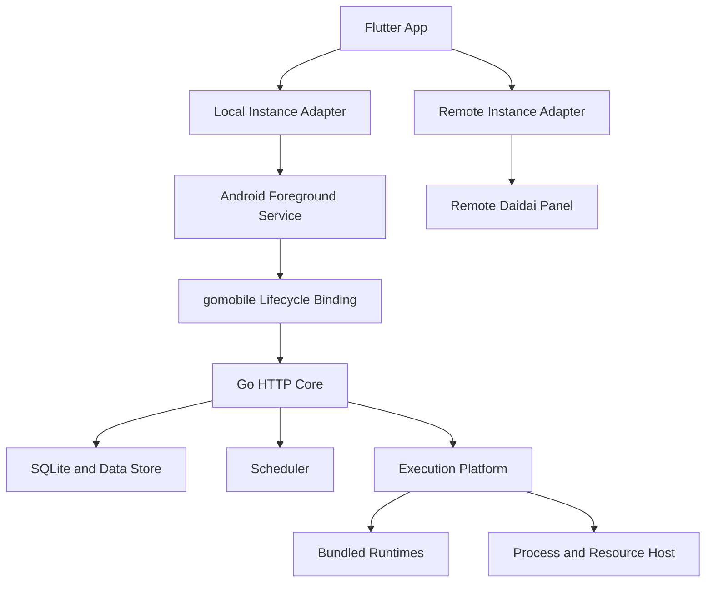
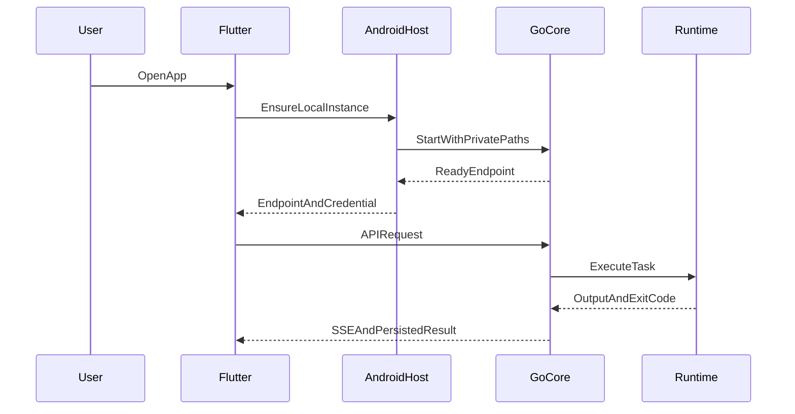

# 系统架构

## 架构原则

- Flutter UI 保持统一的本地与远程管理体验。
- Go 业务规则集中在可重入 Core，HTTP API 与 SSE 保持上游兼容。
- Android 宿主管理生命周期、前台服务、平台安全存储和系统状态。
- 运行时通过稳定平台接口接入任务执行器。
- 上游代码保持低侵入，契约测试作为同步门禁。
- 管理 Core 与运行时就绪状态分离：运行时组件 blocked 时，Core 以 `degraded-ready` 保留管理能力，执行入口保持 fail-closed。

## 总体架构



## 仓库结构目标

```text
daidai-panel-native/
├── app/                         # 导入的 Flutter App
├── panel/                       # 导入的 Go 面板上游
├── mobile-core/                 # 可重入 Core 与 gomobile 薄绑定
├── android-host/                # Service、WorkManager 与平台能力
├── runtimes/                    # 运行时构建脚本、清单和补丁
├── contracts/                   # API、SSE 与能力契约测试
├── scripts/                     # 上游同步和发布工具
└── .monkeycode/                 # 项目文档与功能规格
```

实际导入时优先采用 Git Submodule 保存两个上游仓库，移动端适配代码通过独立目录和小型上游补丁维护。CI 固定上游 commit，并记录到发布版本清单。

## 核心组件

### Go Core

Go Core 从后端 `main()` 抽离，提供可重复启动和显式停止的实例：

```text
NewCore(options) -> Core
Core.Start() -> endpoint
Core.Stop(context)
Core.Status() -> health
```

Core 持有配置、数据库、调度器、执行器和 HTTP Server。数据库初始化、迁移和后台任务启动均返回可处理错误。系统更新、进程退出和宿主资源信息通过平台接口实现。

移动路由注册真实 Auth、Task、Log、Script、Env、Subscription、Notification、Security、System、OpenAPI、Deps、Config、Platform Token、Sponsor 和 Android Runtime Handler。capability middleware 对受控路由执行以下分派：`enabled` 继续进入真实 Handler；disabled 或未声明状态返回稳定的 `PLATFORM_CAPABILITY` 响应。

运行时基线独立汇总八个 runtime ID 的资产完整性与 smoke 状态。任一组件或检查受阻时，Core 状态为 `degraded-ready`，管理 HTTP Core、恢复和诊断仍可用；Runtime Locator 拒绝受阻组件的执行。

### Android Host

Android Host 提供：

- Foreground Service 与持续运行通知。
- WorkManager 恢复检查和错过任务补偿。
- Keystore、私有目录、文件导入导出和本地通知。
- 电量、温度、存储和网络状态。
- Core 限次重启与任务中断恢复。

嵌入式 Go Core无法达到 ready 时，Kotlin fallback 仅暴露 health、capability、认证和备份恢复诊断路由，状态为 `degraded`、模式为 `diagnostic`。fallback 与 Go Core 使用同一安装级 local token，并要求精确 `Host=127.0.0.1:<port>`、`Origin=http://127.0.0.1:<port>` 和 `X-Daidai-Local-Token`。

### Execution Platform

```text
RuntimeProvider     解析固定运行时及其版本
ProcessRunner       启动、停止和回收受管进程树
GitProvider         提供受控 Git 操作
DependencyManager   安装兼容清单内依赖
ResourceProvider    提供 App 与设备资源状态
LifecycleHost       接收前台服务和重启请求
```

当前八个 runtime ID 已统一到 `runtime/manifest.json`、`runtime/compatibility.json`、`runtime/smoke-evidence.json`、APK 元数据提取和 device smoke evidence。当前 smoke records 全部为 blocked；Shell、Git、SSH、Yaegi 和 Go Builder 仍标记为 `blocked-placeholder`。生产资产与 API 28/4K、API 35/4K、API 35/16K 设备通过证据仍待完成。

### Flutter Adapter

本地实例适配器通过 Platform Channel 调用 `StartCore`、`StopCore`、`Status` 和 `Endpoint`。Core 就绪后，Dio 与 SSE 使用动态回环端点，业务页面继续使用现有 API Repository。

实例切换保留完整 `PanelConfig` 类型。本地实例通过 Android Host 重新解析动态 endpoint、instance ID 和 local token，再由连接 monitor 原子更新持久化实例与 Dio session；远程实例继续使用网络健康检查。Android Host 每次启动请求都会复核 Core/fallback 状态，避免返回已失效端口缓存。

### Task Logs and Dependencies

Go Core 与 Kotlin fallback 使用统一任务日志契约：排队状态持续跟踪，运行输出通过增量 cursor 推送，内存日志释放后回读持久日志。日志文件响应包含 `filename`、`path`、`log_id`、大小和创建时间，日志列表关联任务名称。

本地依赖以类型、规范包名和运行时版本作为安装身份。并发任务共享同一安装操作；Python 用户依赖位于运行时目录之外，npm 与 pip 使用共享目录和有界缓存。fallback 使用固定并发 2、队列 32，并限制内存日志窗口。

依赖 spec 保留请求版本并按规范包名查重。显式 Python runtime 请求只安装目标版本；精确 pip/npm 版本必须与已安装版本一致。Go 与 Kotlin tokenizer 保留显式空 argv，多账号环境变量使用带转义的无损 split/join 契约，平台通知凭据与 runtime 路径禁止被数据库变量覆盖。

### Background Idle Policy

Flutter 本地连接 monitor 仅在前台执行 30 秒 reconcile，进入后台后取消 Timer，恢复时立即复核。Kotlin fallback scheduler 启动时检查当前分钟，随后按分钟边界唤醒。WorkManager 通过 `Configuration.Provider` 按需初始化，周期恢复仅在持续调度开启时注册。持续调度 Foreground Service 与原生任务通知行为保持不变。

非持续模式的完整 Core idle shutdown 仍需要持久化 next-run、系统单次唤醒和任务完成回执；当前版本保留 Core 调度以避免后台定时任务丢失。

### Instance-Aware Settings

managed-local 系统页展示动态 API endpoint、Core 状态、Android `:panel` 管理方式、前台服务、调度保障、恢复触发、可用内存和 Python runtime。APK 本地实例将后端自更新与 runtime mutation 声明为 unsupported，本地 Core 重启通过 MethodChannel 完成并采用返回的新 endpoint。服务器实例继续展示后端更新与 service manager 信息。

### Backup Interoperability

Flutter 备份页使用 Android SAF 的 unrestricted picker，再按完整文件名接受 `.json`、`.enc`、`.tgz` 和 `.tar.gz`。该策略避免系统文件提供器将未知 MIME 的 tgz/enc 隐藏。Go Core 与 Kotlin fallback 统一生成和消费 `daidai-panel-backup` 0.4.0 canonical manifest；fallback 可生成 `.tgz` 和 Go AES-GCM `.enc`，并完整映射配置、任务、环境变量、订阅、SSH Key、通知渠道、依赖、任务日志、Task View 和脚本。恢复通过通知渠道、SSH Key 与任务 ID 映射回填外键，目标设备用户、会话、2FA 和设备绑定凭据保持现状。

### Notification Channels

Go notification registry 是渠道类型和字段 schema 的权威来源。Flutter 动态表单解析 `widget`、`default`、`show_when` 与 `push_scope`，条件字段只在命中消息类型时参与展示和必填校验。脱敏配置使用 `********` 占位，Go 更新接口逐字段保留原凭据。

Kotlin fallback schema 14 持久化任务的成功、失败、终止通知开关和绑定渠道 ID。任务终态统一经过通知 dispatcher：绑定任务只发送目标渠道，未绑定任务发送 enabled default 渠道。fallback 支持 Android local、Webhook、Telegram、钉钉、飞书、Bark、PushPlus、Server酱、PushDeer、Discord、Slack、ntfy、Gotify 与 WxPusher，并验证供应商业务响应。`pludplus` 历史拼写会迁移为标准 `pushplus`；Go PushPlus 使用 HTTPS。

删除通知渠道时，Go 与 fallback 在同一事务中清空任务绑定，避免悬空渠道 ID。任务进入 Go `OnTaskFailed` 前置失败路径时也会触发 failure 通知。

### Loopback Web Access

Android 构建将 Panel Web 以 `/local-ui/` base 打包到 APK。Go Core 与 Kotlin fallback 仅在动态 `127.0.0.1` 端口托管静态资源。App 生成 30 秒单次票据并放入 URL fragment；页面通过 POST 兑换 15 分钟 `HttpOnly`、`SameSite=Strict` Cookie。Cookie 仅替代本地传输层 Token，业务 API 继续执行 JWT 与角色授权。静态响应启用 CSP、frame deny、no-referrer 与 nosniff。

## 数据流



## 发布结构

- 单一版本源为 `VERSION.json`，当前版本为 `0.3.15`、Android version code 为 `30150`；`scripts/version.py` 校验派生版本字段。
- Modern APK：`minSdk 28`、`compileSdk 35`、`targetSdk 35`。当前管理 Core 已接线，完整受控运行时交付仍受真实资产和设备 smoke 门禁约束。
- Legacy APK：`minSdk 26`、`compileSdk 35`、`targetSdk 28`，增加私有目录 ELF 执行能力以承载实验性的 `go run`、`go test` 和 `go build`，支持 Android 8 至 Android 15 的已验证设备。
- 每个 Release 分配十位版本代码区间：Modern 使用 `releaseBase + 0`，Legacy 使用 `releaseBase + 1`，基于上一稳定源码构建的 Recovery APK 使用 `releaseBase + 2`。Modern 与 Legacy 通过可移植备份切换；Recovery APK 以更高版本代码覆盖当前故障版本并恢复迁移快照。
- Legacy 轨道每次发布均验证最新 Android 稳定版的安装能力；系统提高最低可安装 target SDK 后，该轨道停止支持受影响系统版本。
- 当前 CI 生成 Modern APK、SHA-256、更新清单和 release evidence。Recovery APK 的独立构建、签名、上传与升级验证仍待实现和取证。

## CI 门禁

1. 读取并校验 `VERSION.json`。
2. tag 路径先校验发布签名 secrets、准备 keystore，并要求同 commit 成功的 device smoke workflow，核验三个 matrix ID 各含八项 pass。
3. 准备 runtime，执行 Go 与契约脚本检查，校验 route contract。
4. 构建并检查 mobile Core AAR，随后执行 Flutter 与 Kotlin 检查。
5. snapshot 分支生成本地 smoke evidence；两条路径均在 APK 构建前后校验 runtime contract，tag 增加 `--strict`。
6. 构建 APK、提取并比对元数据、生成 hash、更新清单和 release evidence。tag 继续校验签名并发布；snapshot 仅上传 CI 产物，可保留 blocked evidence。

当前仓库记录未证明 Kotlin、Flutter、emulator、physical device 或真实设备矩阵已经通过。

## 安全边界

- Core 监听 `127.0.0.1` 动态端口。
- 每次安装生成本地授权密钥，API 校验 Host、Origin 和本地授权头。
- 工作目录经过规范化并限制在 App 私有空间或用户授权目录。
- 进程代理接受结构化程序 ID、argv、环境和工作目录。
- pip 接受纯 Python wheel 与签名兼容清单；npm 默认关闭 lifecycle scripts。
- 日志和诊断包对 Token、Cookie、环境变量值和私钥执行脱敏。
