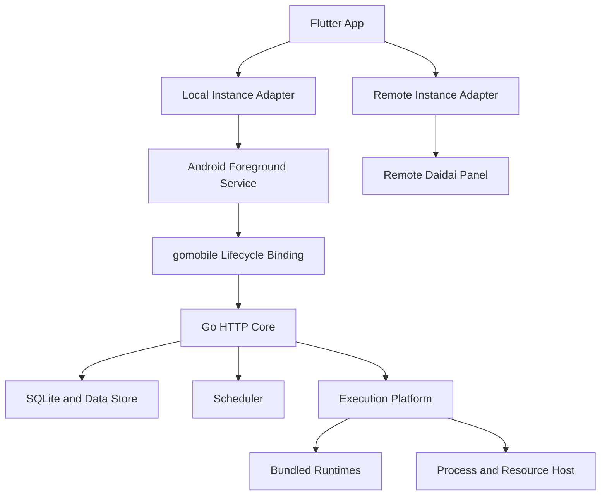
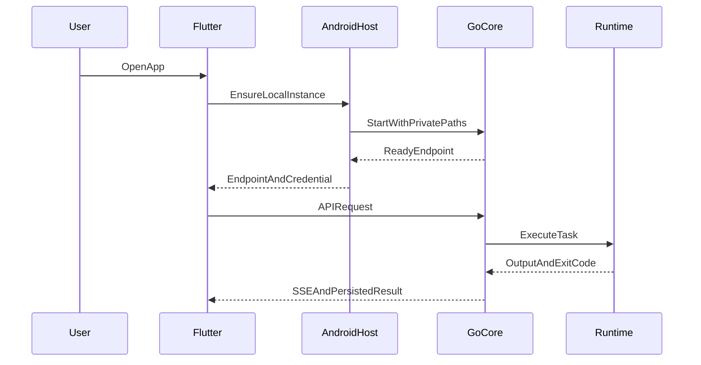

# 系统架构

## 架构原则

- Flutter UI 保持统一的本地与远程管理体验。
- Go 业务规则集中在可重入 Core，HTTP API 与 SSE 保持上游兼容。
- Android 宿主管理生命周期、前台服务、平台安全存储和系统状态。
- 运行时通过稳定平台接口接入任务执行器。
- 上游代码保持低侵入，契约测试作为同步门禁。

## 总体架构



## 仓库结构目标

```text
daidai-panel-native/
├── app/                         # 导入的 Flutter App
├── panel/                       # 导入的 Go 面板上游
├── mobile-core/                 # 可重入 Core 与 gomobile 薄绑定
├── android-host/                # Service、WorkManager 与平台能力
├── runtimes/                    # 运行时构建脚本、清单和补丁
├── contracts/                   # API、SSE 与能力契约测试
├── scripts/                     # 上游同步和发布工具
└── .monkeycode/                 # 项目文档与功能规格
```

实际导入时优先采用 Git Submodule 保存两个上游仓库，移动端适配代码通过独立目录和小型上游补丁维护。CI 固定上游 commit，并记录到发布版本清单。

## 核心组件

### Go Core

Go Core 从后端 `main()` 抽离，提供可重复启动和显式停止的实例：

```text
NewCore(options) -> Core
Core.Start() -> endpoint
Core.Stop(context)
Core.Status() -> health
```

Core 持有配置、数据库、调度器、执行器和 HTTP Server。数据库初始化、迁移和后台任务启动均返回可处理错误。系统更新、进程退出和宿主资源信息通过平台接口实现。

### Android Host

Android Host 提供：

- Foreground Service 与持续运行通知。
- WorkManager 恢复检查和错过任务补偿。
- Keystore、私有目录、文件导入导出和本地通知。
- 电量、温度、存储和网络状态。
- Core 限次重启与任务中断恢复。

### Execution Platform

```text
RuntimeProvider     解析固定运行时及其版本
ProcessRunner       启动、停止和回收受管进程树
GitProvider         提供受控 Git 操作
DependencyManager   安装兼容清单内依赖
ResourceProvider    提供 App 与设备资源状态
LifecycleHost       接收前台服务和重启请求
```

### Flutter Adapter

本地实例适配器通过 Platform Channel 调用 `StartCore`、`StopCore`、`Status` 和 `Endpoint`。Core 就绪后，Dio 与 SSE 使用动态回环端点，业务页面继续使用现有 API Repository。

## 数据流



## 发布结构

- Modern APK：`minSdk 28`、`compileSdk 35`、`targetSdk 35`，提供完整管理能力、受控运行时、Yaegi Go 源码执行和 Go 工具链构建导出。
- Legacy APK：`minSdk 26`、`compileSdk 35`、`targetSdk 28`，增加私有目录 ELF 执行能力以承载实验性的 `go run`、`go test` 和 `go build`，支持 Android 8 至 Android 15 的已验证设备。
- 每个 Release 分配十位版本代码区间：Modern 使用 `releaseBase + 0`，Legacy 使用 `releaseBase + 1`，基于上一稳定源码构建的 Recovery APK 使用 `releaseBase + 2`。Modern 与 Legacy 通过可移植备份切换；Recovery APK 以更高版本代码覆盖当前故障版本并恢复迁移快照。
- Legacy 轨道每次发布均验证最新 Android 稳定版的安装能力；系统提高最低可安装 target SDK 后，该轨道停止支持受影响系统版本。
- GitHub Release 同时发布 Modern、Legacy、Recovery APK、SHA-256、签名指纹、SBOM、第三方许可和版本清单。

## 安全边界

- Core 监听 `127.0.0.1` 动态端口。
- 每次安装生成本地授权密钥，API 校验 Host、Origin 和本地授权头。
- 工作目录经过规范化并限制在 App 私有空间或用户授权目录。
- 进程代理接受结构化程序 ID、argv、环境和工作目录。
- pip 接受纯 Python wheel 与签名兼容清单；npm 默认关闭 lifecycle scripts。
- 日志和诊断包对 Token、Cookie、环境变量值和私钥执行脱敏。
