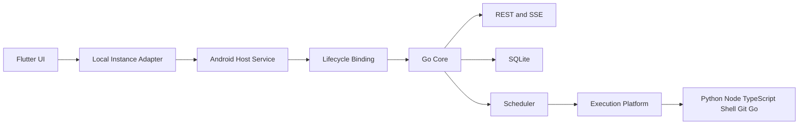

# Android 本机面板技术设计

Feature Name: android-local-panel
Updated: 2026-07-27

## Description

本设计将现有 Flutter App 和 Go 面板组合为普通 Android ARM64 手机上的自包含本机面板。每条发布轨道提供一个 APK，同一设备同一时刻安装一个轨道。系统使用 Android Foreground Service 管理可嵌入 Go HTTP Core，通过回环 REST/SSE 复用现有 UI，并使用 APK 内置运行时执行自动化任务。

## Architecture

推荐正式架构为“Android Foreground Service + gomobile 生命周期薄绑定 + Go 回环 HTTP Core + 平台执行接口”。独立 Go Sidecar 只用于最早期 PoC，直接 gomobile 业务 API 作为远期演进方向。



## Source Integration

- Flutter App 与 Go 面板以 Git Submodule 固定上游 commit。
- `mobile-core` 保存 Core 抽离和 Android 平台适配代码。
- 必须修改上游的补丁保持小型、独立并带契约测试。
- 同步 CI 定期检查固定上游分支，生成变更报告和同步 PR。
- Release manifest 记录全部源码和运行时来源。

## Components and Interfaces

### Core Lifecycle

```go
type CoreOptions struct {
    DataDir      string
    ScriptsDir   string
    LogsDir      string
    Dependencies string
    BindHost     string
    Port         int
    Capabilities Capabilities
}

type Core interface {
    Start() (Endpoint, error)
    Stop(context.Context) error
    Status() Health
}
```

Core 持有配置、GORM DB、Scheduler、Executor 和 HTTP Server。包级单例逐步迁移为实例字段。数据库连接、迁移和后台 worker 初始化返回错误，Core 停止时按依赖逆序释放资源。

### gomobile Binding

绑定层只使用 gomobile 支持的标量和 JSON：

```text
StartCore(optionsJSON) -> resultJSON
StopCore(timeoutMillis) -> errorText
CoreStatus() -> statusJSON
CoreEndpoint() -> endpoint
```

业务 API 保持 HTTP，避免将 Gin Handler、GORM、channel 和复杂 DTO 暴露给 Kotlin。

### Android Host

- `ManagedPanelService`：启动 Core、切换前台状态、处理停止和重启。
- `ManagedPanelBridge`：向 Flutter 暴露生命周期接口。
- `RecoveryWorker`：检查中断任务、补偿计划和升级后健康状态。
- `PlatformResourceProvider`：提供电量、温度、内存、磁盘和网络状态。
- `SecureKeyProvider`：通过 Keystore 创建和读取安装级密钥。

持续运行使用 `specialUse` 类型的 `ManagedPanelService`，并在 manifest 中声明 `panel_task_scheduler` subtype。有限时长的 Git 与依赖下载使用独立 `TransferService` 及 `dataSync` 类型。服务只由用户可见操作启动；系统强制停止后，App 等待用户再次打开并展示中断记录。WakeLock 仅在活动任务和调度临界区内持有。`ManagedPanelService.startForeground()` 只传入 `FOREGROUND_SERVICE_TYPE_SPECIAL_USE`；`TransferService.startForeground()` 只传入 `FOREGROUND_SERVICE_TYPE_DATA_SYNC`，并在 `onTimeout()` 中停止传输、持久化可重试状态和结束服务。

Manifest 必须声明：

```xml
<uses-permission android:name="android.permission.FOREGROUND_SERVICE" />
<uses-permission android:name="android.permission.FOREGROUND_SERVICE_SPECIAL_USE" />
<uses-permission android:name="android.permission.FOREGROUND_SERVICE_DATA_SYNC" />

<service
    android:name=".ManagedPanelService"
    android:exported="false"
    android:foregroundServiceType="specialUse">
    <property
        android:name="android.app.PROPERTY_SPECIAL_USE_FGS_SUBTYPE"
        android:value="panel_task_scheduler" />
</service>

<service
    android:name=".TransferService"
    android:exported="false"
    android:foregroundServiceType="dataSync" />
```

### Execution Platform

```go
type RuntimeProvider interface {
    Resolve(runtimeID string) (Runtime, error)
    Health(runtimeID string) RuntimeHealth
}

type ProcessRunner interface {
    Start(context.Context, ProcessSpec, OutputListener) (ProcessHandle, error)
}

type GitProvider interface {
    Clone(context.Context, CloneSpec) error
    Fetch(context.Context, FetchSpec) error
    Checkout(context.Context, CheckoutSpec) error
}

type DependencyManager interface {
    Install(context.Context, DependencySpec, ProgressListener) error
    Remove(context.Context, DependencySpec, ProgressListener) error
}
```

`ProcessSpec` 使用固定 program ID、argv、环境、规范化工作目录、超时和输出上限。Android Host 解析 program ID 到 `nativeLibraryDir` 或嵌入式运行时入口。

### Flutter Integration

- `PanelConfig` 增加 `remote` 与 `managedLocal` 类型、实例 ID 和自动启动策略。
- `/boot` 在恢复认证前确保本地 Core 就绪。
- Dio 继续动态切换 Base URL；401 在响应链中统一触发刷新。
- SSE 在 Core 重启和端点变化后重新建立连接。
- 本地故障映射为生命周期错误，远程故障保持网络错误语义。

## Runtime Packaging

### Common Rules

- 首发只提供 `arm64-v8a`。
- 原生 ELF 与共享库使用 Android NDK、Bionic 和统一 API level 构建。
- 可执行 ELF 随 APK 原生库目录安装，并通过绝对路径启动。
- Assets 保存标准库、TypeScript、CA、离线依赖和许可材料。
- CI 校验 PIE、RELRO、NX、依赖库、SONAME、text relocation 与 16 KB alignment。

### Python

- 首期提供 Python 3.12，并保留迁移到受官方 Android 支持版本的构建通道。
- 纯 Python wheel 可安装到私有依赖目录。
- 原生扩展仅接受兼容清单内 Android ARM64 wheel。
- pip 使用哈希锁定、二进制优先和受控索引策略。

### Node.js and TypeScript

- Node 版本以发布时仍受安全维护的 LTS 为准，兼容性清单记录与上游 Node 20 任务差异。
- TypeScript 使用固定版本 `tsc.js`，由内置 Node 直接执行。
- npm 用户依赖安装启用 lifecycle scripts，并继续设置 `audit=false`、`fund=false`。
- 原生 addon 仅接受签名兼容清单。

### Shell and Git

- Shell 使用固定命令表、argv 校验和工作区路径限制。
- Git 首版实现 HTTPS、SSH、known_hosts、稀疏检出和原子替换。
- Git hooks、外部 filter、pager、editor 和凭据 helper 由平台配置固定管理。

### Go Dual Track

- Modern APK 使用 `minSdk 28`、`compileSdk 35` 和 `targetSdk 35`，包含 Go 工具链、模块缓存、格式化、静态检查和构建导出。`go-interpret` 任务由 Yaegi 执行纯 Go 源码，返回运行输出、解释错误和耗时；该路径仅开放允许的标准库和预注册包，不支持 CGO、汇编、编译器指令、`embed` 和 Go modules。`go-build` 任务调用工具链并返回构建日志、状态、产物路径、大小和 SHA-256，产物只用于导出。
- Legacy APK 使用 `minSdk 26`、`compileSdk 35` 和 `targetSdk 28`，提供实验性的 `go run`、`go test` 和 `go build`。
- 每个 Release 使用递增且预留十位的 `releaseBase`。Modern、Legacy、Recovery 的 `versionCode` 分别为 `releaseBase + 0`、`releaseBase + 1`、`releaseBase + 2`。Recovery 使用上一稳定源码和当前签名构建，其版本代码允许覆盖故障版本。Modern 与 Legacy 使用可移植备份、卸载和导入流程切换轨道。
- CGO 与原生链接能力使用 Android ARM64 兼容清单。

## Data Models

### Release Manifest

以下 JSON 是构建产物 Schema 示例。发布流水线生成所有值，并阻止占位值进入 Release。

```json
{
  "appVersion": "0.1.0",
  "track": "modern",
  "flutterUpstream": "40-character-hex-string",
  "panelUpstream": "40-character-hex-string",
  "schemaVersion": 1,
  "abi": "arm64-v8a",
  "runtimes": [],
  "assetsSha256": "64-character-hex-string"
}
```

### Runtime Manifest

```json
{
  "id": "python-3.12-android-arm64",
  "version": "semantic-version-string",
  "abi": "arm64-v8a",
  "entrypoint": "python",
  "capabilities": ["python", "pip"],
  "sha256": "64-character-hex-string"
}
```

### Local Instance Identity

本地实例包含稳定 `instanceId`、动态端点、Core 版本、Schema 版本和授权密钥引用。端点只用于当前启动周期，密钥值只存储在 Keystore。

### Backup Keys

- 迁移快照使用 Keystore 中的安装级密钥，只服务当前安装和覆盖升级。
- 可移植备份生成随机归档密钥，并使用 Argon2id 从用户口令派生的密钥进行封装。
- Manifest 保存 KDF 参数、salt、归档摘要和 Schema 版本。
- 卸载重装与跨设备恢复要求用户提供备份口令；口令丢失时归档保持不可恢复状态。

### Upgrade Recovery

1. 新版本启动前创建安装级加密迁移快照并停止 Scheduler。
2. 新 Core 迁移 Schema 并执行健康检查。
3. 健康检查失败时，新 Core 停止全部 worker、关闭数据库并进入只读诊断状态。
4. 用户安装同一 Release 的 Recovery APK；更高 `versionCode` 允许签名覆盖安装。
5. 每个完整数据集存放在独立代际目录中，`active-generation` 指针文件记录当前代际 ID；活动代际持有唯一写租约。切出代际完成 WAL checkpoint 并释放写租约后进入逻辑封存状态，重新激活时可幂等获取写租约。Core 只通过活动指针解析数据库、脚本和配置路径。
6. Recovery Core 在活动指针同一父目录创建 `recovery-transaction.json`，记录事务 ID、`oldGeneration`、`newGeneration`、`phase` 和摘要。阶段包括 `building`、`prepared`、`old-generation-sealed`、`pointer-committed`、`verified` 和 `rolled-back`。事务日志采用临时文件写入、文件 `fsync`、原子重命名和父目录 `fsync` 持久化每次阶段转换。
7. Recovery Core 先把阶段写为 `building`，再将快照恢复到同文件系统的新代际目录，关闭并逐个 `fsync` 数据文件、SQLite 主库、WAL、Manifest 和摘要；嵌套目录按自底向上顺序 `fsync`。随后校验 Manifest、文件摘要、SQLite `integrity_check` 和 Schema，并把事务阶段写为 `prepared`。
8. Recovery Core 停止全部业务 worker，关闭活动数据库并完成 WAL checkpoint，释放旧代际写租约，再把事务阶段写为 `old-generation-sealed`。
9. Recovery Core 在活动指针同一父目录创建包含新代际 ID 的临时指针，执行文件 `fsync` 后通过单次原子重命名替换 `active-generation`，对父目录执行 `fsync`，再把事务阶段写为 `pointer-committed`。
10. Recovery Core 按新指针重新打开数据库并执行完整性检查。检查成功后获取新代际写租约，把事务阶段写为 `verified`，启动上一稳定 Core并延迟清理旧代际；失败时以同一原子指针协议切回旧代际、重新获取旧代际写租约并写为 `rolled-back`。
11. Core 每次启动先读取恢复事务并结合活动指针、代际 Manifest 和写租约状态推断实际进度，使“文件操作已落盘且阶段日志尚未落盘”的窗口可重入。`building` 清理未完成新代际并重新激活旧代际；`prepared` 与 `old-generation-sealed` 回切并重新激活旧代际；`pointer-committed` 复检新代际并提交或回切；`verified` 与 `rolled-back` 校验活动指针和写租约后完成清理。状态机幂等结束前保持业务 worker 停止。
12. Core 忽略未被活动指针或恢复事务引用的不完整代际。旧代际在事务达到 `verified` 且超过保留期前保持逻辑封存并禁止清理。
13. 只读诊断状态允许导出数据库、快照和脱敏诊断包。

## Correctness Properties

1. 同一时刻每个安装只存在一个活动 Core 实例。
2. Core 就绪状态要求数据库迁移、Router、Scheduler 和回环监听全部成功。
3. 任务终态包含退出码或平台中断原因，并且每次执行只有一个终态。
4. 工作区规范化路径始终位于 App 私有根目录或用户授权目录。
5. 运行时资产摘要必须匹配 Release manifest 后才能启用对应能力。
6. Schema 迁移前必须存在通过完整性校验的恢复快照。
7. 上游同步产物必须通过 API、SSE、迁移和运行时契约测试。

## Error Handling

- Core 启动失败：返回阶段化错误，Service 限次重试并保留诊断记录。
- 数据库迁移失败：停止 Core 并进入只读诊断状态；用户安装当前 Release 中具有更高版本代码的 Recovery APK，由 Recovery Core 原子恢复快照。
- 运行时损坏：隔离单个运行时能力，其他管理与执行能力继续工作。
- 子进程异常：回收进程树，持久化退出信息并释放运行时引用。
- 系统回收：恢复后将遗留运行记录标记为中断，并按任务策略补偿一次。
- 存储不足：暂停安装和低优先级任务，保留数据库写入所需安全空间。
- 上游契约变化：同步流水线阻断合入并生成接口差异报告。

## Test Strategy

### Unit and Contract

- Core 生命周期、重复启停、错误注入和资源释放。
- API 响应、认证刷新、上传下载和 SSE 重连契约。
- Scheduler 状态机、补偿幂等、超时和取消。
- 路径规范化、环境过滤、依赖兼容清单和日志脱敏。

### Runtime

- 断网执行 Python、Node.js、TypeScript、Shell、Git 与 Go smoke。
- pip 纯 Python、Android 原生 wheel 和平台冲突样例。
- npm 纯 JS、WASM、原生 addon 和 lifecycle script 安装样例。
- Git HTTPS、SSH、凭据失效、断网恢复和原子更新。

### Android Integration

- API 26：Legacy 验证安装、Core、`specialUse` Service、私有 ELF 和 `go run/go test/go build`。
- API 27：Legacy 验证安装、Core、`specialUse` Service、私有 ELF 和 `go run/go test/go build`。
- API 28：Legacy 验证完整能力；Modern 验证安装、Core、`specialUse` Service、Yaegi 与构建导出。
- API 29、31、34、35：Modern 验证完整能力，Legacy 验证系统允许安装时的完整能力；每次发布增加最新稳定 Android API。
- 4 KB 与 16 KB page size。
- App 前后台、锁屏、Doze、系统回收、强制停止和覆盖升级。
- Pixel、Samsung、Xiaomi、OPPO、vivo 代表设备。
- 100 次启停、24 小时和 7 天持续运行测试。
- Foreground、锁屏、Doze、系统回收、设备重启、强制停止和 OEM 省电模式分别记录启动偏差、漏执行、补偿和用户介入要求。

### Release Gates

- APK 签名、ABI、SHA-256、SBOM 和许可材料完整。
- 数据迁移、快照恢复和 Modern/Legacy 覆盖安装通过。
- Recovery 状态机在 `building` 至 `rolled-back` 的每个文件写入、文件 `fsync`、目录 `fsync`、写租约变更、指针 `rename` 和阶段日志提交前后注入进程终止与断电，并注入短写、`ENOSPC`、`fsync` 失败和 `rename` 失败。每个样本重启后活动数据完整、活动代际持有唯一写租约，业务 worker 仅在事务收敛后启动。
- API/SSE 契约、离线运行时和安全测试全部通过。
- API 26、27、28 边界矩阵中的适用轨道全部通过安装、Core、Foreground Service 和 Go 能力测试。
- 调度报告包含时间偏差、漏执行率、补偿率和系统中断明细。
- 7 天测试在 Foreground Service 健康且系统未强制停止的样本中达到 99% 的任务在 60 秒内启动；全部任务在 15 分钟恢复窗口内执行或写入明确中断记录。
- Modern APK 不超过 500 MB且安装后只读基线不超过 1.5 GB；Legacy APK 不超过 650 MB且安装后只读基线不超过 2 GB。升级与首次展开前要求可用空间达到所选 APK 大小两倍加 1 GB。

## Delivery Milestones

1. Core 生命周期与本地管理：Core 抽离、回环 API、SQLite、认证、任务 CRUD 和 Flutter 启动闭环。
2. 脚本运行时：Python、Node.js、TypeScript、受控 Shell 和 Modern Go 解释执行。
3. 依赖与 Git：兼容清单、pip、npm、HTTPS、SSH 和订阅原子更新。
4. 调度恢复：Foreground Service、恢复补偿、资源保护和厂商设备测试。
5. 备份升级：字段加密、可移植备份、Schema 快照和上一 APK 回装。
6. Legacy Go 轨道：旧 target SDK 构建、`go run`、`go test`、覆盖安装与退役门禁。

## References

[^1]: (Repository) - Flutter App: https://github.com/linzixuanzz/Dumb-Panel-APP
[^2]: (Repository) - Go panel: https://github.com/linzixuanzz/daidai-panel
[^3]: (Android) - Android 10 behavior changes: https://developer.android.com/about/versions/10/behavior-changes-10
[^4]: (Android) - 16 KB page sizes: https://developer.android.com/guide/practices/page-sizes
[^5]: (Android) - Foreground service restrictions: https://developer.android.com/develop/background-work/services/fgs/restrictions-bg-start
