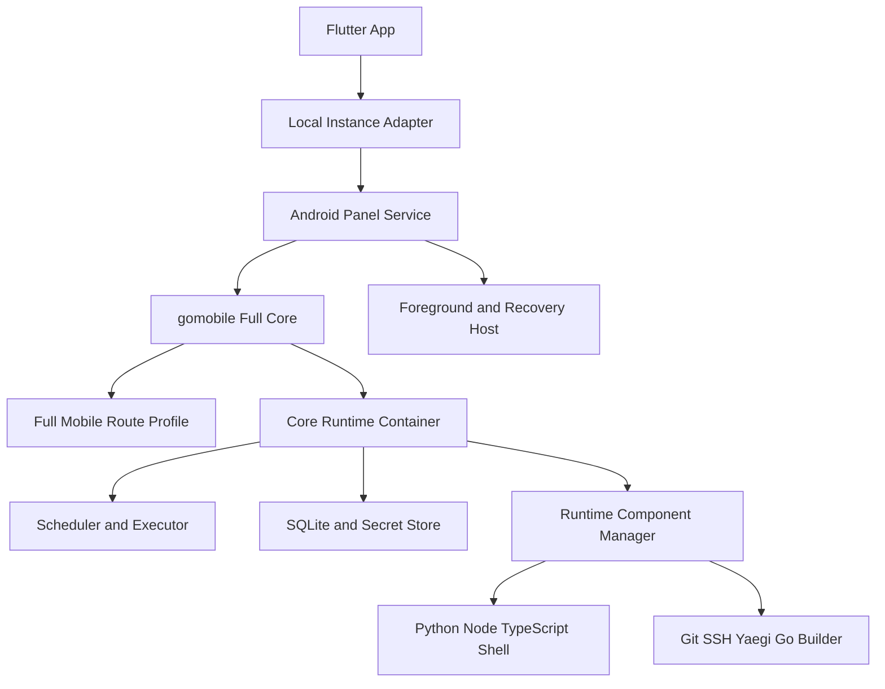
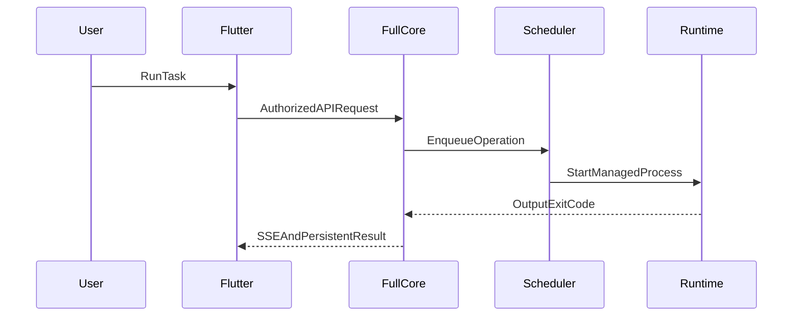

# Android Modern 全功能本机面板设计

Feature Name: android-modern-full-panel
Updated: 2026-08-21

## Description

本设计将当前管理型 gomobile Core 扩展为 Modern Android 全功能本机面板。正式架构采用“Go Core + Android Platform Adapter + APK 签名预置运行时 + Foreground Scheduler”。产品保留远程面板连接，默认创建并使用本地实例。

## Product Boundary

- 本地功能零配置：Core、SQLite、运行时、公开 Git、任务、日志和备份安装即用。
- 外部服务按需配置：私有 Git、第三方通知和外部 OpenAPI 使用用户自己的服务凭据。
- Go Interpret 使用 Yaegi；Go Build 只导出产物。
- 原生依赖受兼容清单约束。
- Cron 提供 Android 可观测保障等级和补偿记录。

## Architecture



## Components and Interfaces

### Full Mobile Route Profile

替换当前 `SetupManagement` 的固定子集，按能力组注册：

```text
AuthRoutes
TaskManagementRoutes
TaskExecutionRoutes
ScriptRoutes
LogRoutes
EnvironmentRoutes
IntegrationRoutes
DependencyRoutes
SecurityRoutes
SystemSafeRoutes
RuntimeRoutes
```

服务器专属 Docker、systemd 和宿主包管理 API 通过 Android 等价 Handler 返回能力结果。

### Core Runtime Container

```go
type RuntimeContainer interface {
    Start(context.Context) error
    Stop(context.Context) error
    Health() HealthSnapshot
}
```

Container 持有数据库、Scheduler、Executor、Subscription Scheduler、Backup Scheduler、Log Cleanup、Resource Provider、Notification Dispatcher 和 Operation Store。启动按依赖顺序执行，停止按逆序执行。

### Platform Adapter

```go
type ProcessSupervisor interface {
    Start(context.Context, ProcessSpec, OutputSink) (ProcessHandle, error)
}

type RuntimeLocator interface {
    Resolve(RuntimeID) (Executable, error)
}

type SecretStore interface {
    Seal(context.Context, string, []byte) (SealedValue, error)
    Open(context.Context, string, SealedValue) ([]byte, error)
}

type BackupStorage interface {
    Export(context.Context, BackupArchive) error
    Import(context.Context) (BackupArchive, error)
}
```

Android Host通过 Binder 提供 Keystore、通知、资源、电量、温度、Storage Access Framework 和恢复事件。

### Runtime Component Manager

每个运行时包含版本化 Manifest：

```json
{
  "id": "python-3.12-android-arm64",
  "version": "3.12.x",
  "abi": "arm64-v8a",
  "entrypoint": "python",
  "sha256": "64-character-hex-string",
  "capabilities": ["python", "pip", "venv"]
}
```

Runtime Manager负责安装包内资产校验、只读入口解析、健康检查、引用计数、空间预算和版本切换。

### Panel Profile and Capability Handshake

Flutter 使用单一 `PanelProfile` 表达本地与远程实例：

```text
PanelProfile
- instanceId
- instanceMode
- serverVersion
- apiVersion
- schemaVersion
- capabilityRevision
- capabilities
- source
```

新后端通过 `/api/v1/client-handshake` 返回 profile。旧后端返回 404 时，legacy probe adapter 使用现有端点探测生成 profile。Dio capability interceptor 解析 `PLATFORM_CAPABILITY` 响应并实时更新 profile。菜单、路由 guard 和页面操作均读取同一 profile，避免页面局部探测与全局可见性分离。

### Unified Mirror Configuration

镜像配置使用同一字段模型 `pip_mirror`、`npm_mirror`、`linux_mirror`。Android Host 将配置持久化到本地数据库并同步 rootfs 配置文件；Go Core dependency provider 通过 platform adapter 读取 Android rootfs、PRoot 和镜像配置。配置优先级为用户保存值、导入 rootfs 值、内置默认值。初始化只补齐缺失值。

默认值：

- Alpine APK：`https://repo.huaweicloud.com/alpine`
- Python pip：`https://mirrors.aliyun.com/pypi/simple`
- Node.js npm：`https://registry.npmmirror.com`

### Fallback Execution Parity

Kotlin fallback 仅承担 Go Core 无法启动时的兼容执行路径，但任务语义必须保持一致：结构化 argv、完整环境注入、进程句柄映射、可终止进程树、运行中日志增量落盘、游标 SSE、缺失 pip/npm 依赖识别与有界重跑。共享 contract tests 对 Go Core 和 fallback 运行同一组输入输出断言。

### Instance Switching and Idle Lifecycle

实例身份使用 `PanelConfig.type` 与稳定 instance ID，动态 endpoint 仅作为连接属性。切换到 managed-local 时，Flutter 直接向 Android Host 请求实时状态，解析 endpoint 和 local token 后通过 `ManagedLocalConnectionMonitor.adoptHealthy` 原子提交。远程健康检查仅用于 remote 实例。

Flutter 连接 monitor 仅在前台运行周期 reconcile，进入后台后取消 Timer，恢复前台时立即复核。Android Host 每次 `ensureStarted` 都复核 Core/fallback 健康状态，缓存仅作为状态快照。WorkManager 使用 AndroidX Startup 完成初始化；fallback cron 对齐分钟边界，减少空闲唤醒。

### Dependency and Environment Contracts

依赖请求拆分为原始 spec、规范包名、版本约束和运行时版本。显式 Python runtime 请求只创建一个安装操作；未指定 runtime 时保留兼容客户端的全支持版本语义。安装、singleflight、后置验证和卸载共享同一规范包名。

Go 与 Kotlin tokenizer 使用 `tokenStarted` 保留显式空 argv。多账号变量使用支持 JSON array、转义反斜杠、字面 `&` 和空元素的 split/join contract。平台保留变量在用户变量合并后覆盖，保护 local token、通知 endpoint、解释器和依赖路径。

### Instance-Aware System Settings

系统设置按 managed-local 与 remote 两种模式渲染。managed-local 展示动态 endpoint、Android `:panel` 管理方式和 runtime 摘要，Core 重启调用 MethodChannel lifecycle API；服务器自更新、systemd service 和 runtime mutation 对 APK 本地实例声明为 unsupported。remote 保留后端更新和服务管理能力。

### Android Executable Packaging

所有固定 ELF 以 `lib<runtime>_exec.so` 形式放入 `android/app/src/main/jniLibs/arm64-v8a/`，Gradle 使用 `jniLibs.useLegacyPackaging = true`，Manifest 设置 `android:extractNativeLibs="true"`。Android Host 只从 `ApplicationInfo.nativeLibraryDir` 解析可执行入口，禁止从 App 可写目录执行 ELF。运行时只持久化逻辑 Runtime ID，每次启动均重新读取 `ApplicationInfo.nativeLibraryDir`。

Python 标准库、TypeScript 源码、CA、Git 模板和 Go 标准库数据作为非可执行 assets 解压至版本化只读基线目录。Go `compile`、`link`、`asm` 等会被启动的工具均作为 APK 固定 ELF 交付；Go Builder 生成的目标文件只允许导出，不允许由 Modern APK 执行。

CI 对每个入口执行以下门禁：

- AArch64 与 Android/Bionic ABI。
- PIE、RELRO、NX、无 text relocation。
- 4 KB 与 16 KB page alignment。
- `DT_NEEDED` 全部来自 Android 系统或同一 APK。
- API 28、29、31、34、35 真机或等价系统镜像启动 smoke。
- 每个 ELF 使用 `$ORIGIN` RUNPATH 或静态链接解析同包共享库，CI 在最终签名 APK 安装后验证 linker 依赖。
- 构建保留可执行 ELF 权限和符号处理策略，禁止 Android Gradle Plugin 对入口执行破坏性 strip。
- 覆盖升级后重新解析入口路径并复验 SHA-256，禁止复用旧绝对路径。

### Script Isolation

完整 Python、Node、Shell 和依赖兼容采用同应用 UID 的 `:runner` 受管进程。该模型允许访问版本化 stdlib、node_modules、工作目录和构建数据，也意味着用户代码理论上可访问 App 私有文件。产品信任模型定义为：用户手工创建的脚本属于受信任本地代码；订阅脚本、npm lifecycle、原生 wheel 和 Node addon 默认禁止执行。授权记录绑定来源、版本、SHA-256、能力集合和授权时间；任一内容摘要或能力变化均使授权失效并要求重新确认。

Secret Store中的密钥保持密文，正常调用路径只向Runner传递任务明确选择的解密值；数据库、备份和授权 Token不通过环境变量传递。由于Runner与App共享UID，获授权代码仍可能读取或修改App私有文件，并可能利用同UID可用的平台能力。授权提示必须表述为“接近完整App私有数据权限”。路径限制、结构化argv、网络能力声明和进程配额属于纵深防护，并不构成UID内安全边界。

`android:isolatedProcess="true"` Worker仅用于不依赖持久目录的纯计算、Yaegi受限符号集和WASM任务，输入输出通过 Binder/ParcelFileDescriptor传递。脚本信任等级、同 UID 风险、可用能力和敏感文件可达性写入 Capability Snapshot。

### Bundled Runtimes

- Python：Android/Bionic CPython、stdlib、SSL、SQLite、pip、venv、CA。
- Node.js：Android/Bionic Node LTS、npm、npx、CA。
- TypeScript：固定版本 `typescript` 与 `ts-node`。
- Shell：受控 BusyBox/Toybox 命令集和 Shell runner。
- Git/SSH：Android CLI Git、HTTPS、CA、SSH、known_hosts。
- Go：Yaegi 解释执行；固定 Go 构建工具只生成导出产物。

所有会被启动的 ELF 必须随 APK 签名交付并通过 ARM64、Bionic、PIE、RELRO、NX 和 16 KB page size 校验。

## Data Models

### Persistent Operation

```text
Operation
- id
- kind
- state
- phase
- sequence
- progress
- exitCode
- errorCode
- createdAt
- startedAt
- endedAt
- logCursor
```

任务执行、依赖安装、运行时校验、订阅拉取和备份恢复共享统一 Operation 模型。

### Capability Snapshot

```text
Capability
- id
- state
- reasonCode
- runtimeVersion
- guaranteeLevel
- checkedAt
```

### Backend Route Trace

构建生成 `contracts/backend-api-mobile.json`，逐项记录上游 Auth、Task、Log、Script、Env、Subscription、Notification、SSH Key、User、Security、System、OpenAPI、Deps、Config、Platform Token、Sponsor 和 Android Runtime 路由：

```text
RouteTrace
- method
- path
- module
- mobileStatus
- androidEquivalent
- authContract
- streamContract
- testCase
```

发布要求追踪矩阵覆盖率为 100%，每个路由必须具备契约测试。

唯一分母由固定上游 commit 的规范化 Setup fixture 生成。Fixture启用所有路由功能开关、覆盖全部构建标签组合，并为每种条件注册分支分别调用完整 `router.Setup` 后收集 `engine.Routes()`。CI 对 `method + normalizedPath` 去重并做配置分支并集。Handler注册代码同时声明鉴权、SSE、上传下载元数据；契约测试验证声明与中间件行为。Full Mobile Route Profile与该并集做双向差集，任意新增、删除、方法或属性变化未更新追踪记录时构建失败。

### Portable Backup Envelope

可移植备份使用随机 256 位归档密钥和 AES-256-GCM。用户口令通过 Argon2id 派生密钥加密归档密钥；Manifest 保存版本、salt、Argon2id 参数、nonce、文件摘要和 Schema。设备内迁移快照使用 Keystore 安装级密钥。错误口令、篡改、版本不兼容和空间不足均在替换活动数据前失败。

### Runtime Matrix

| Runtime ID | 固定入口 | 支持数据 | 默认执行模式 | Smoke 成功条件 |
|---|---|---|---|---|
| `python-3.12-android-arm64` | `libpython_exec.so` | stdlib zip、CA、wheelhouse | trusted runner | 输出 `PY_OK`，SSL/SQLite/venv 成功 |
| `node-lts-android-arm64` | `libnode_exec.so` | npm、CA、ICU | trusted runner | CommonJS、ESM、HTTPS 输出成功 |
| `typescript-stable` | Node 固定 loader | typescript、ts-node bundle | trusted runner | `.ts` 输出 `TS_OK` |
| `shell-android-arm64` | `libshell_exec.so` | 受控命令表 | trusted runner | 管道、退出码、停止成功 |
| `git-android-arm64` | `libgit_exec.so` | CA、templates | broker | clone/fetch/sparse checkout 成功 |
| `ssh-android-arm64` | `libssh_exec.so` | known_hosts | broker | 固定 Host Key 连接成功，错误指纹失败 |
| `yaegi-go` | gomobile interpreter | 允许符号表 | isolated worker | 输出 `GO_INTERPRET_OK` |
| `go-builder-android-arm64` | 固定 compiler/linker | GOROOT、module seed | trusted builder | 生成产物与 SHA-256且不执行产物 |

## Execution Flow



## Error Handling

- 运行时损坏：隔离单组件，保留管理功能和其他运行时。
- 依赖不兼容：返回 ABI、libc、运行时版本和兼容清单错误码。
- 系统回收：启动时对账运行中 Operation并写入中断或补偿结果。
- 存储不足：在下载、解压和迁移前执行峰值空间检查。
- Git 冲突：保留旧工作区并提供冲突详情。
- Core 停止：停止接收新工作，取消活动进程，等待日志落盘后关闭数据库。

## Security

- Core 保留动态回环端点和本地 Token、Host、Origin 校验。
- 运行时入口只接受 Manifest 中的固定程序 ID。
- argv 使用结构化参数，禁止拼接 Shell 字符串。
- Secret Store使用 Android Keystore封装数据密钥。
- pip/npm 禁止来源不明的原生代码和默认 lifecycle scripts。
- Git hooks、外部 filter、pager、editor 和 credential helper 默认关闭。
- Runtime、Secret Store、签名清单和 isolated Worker 是 Execution 里程碑的前置条件。

## Scheduling Guarantees

- `specialUse` Foreground Service：Core 与 Scheduler 活跃，99% 任务在计划后 60 秒内启动。
- App 启动、`:panel` 进程恢复、`BOOT_COMPLETED` 和网络恢复：触发一次性 Recovery Worker。
- 周期 Recovery Work：Android 允许的最短周期 15 分钟，仅作为对账触发源。
- 恢复计时从 WorkManager 实际开始执行计算，15 分钟内补偿或写中断记录。
- 用户强制停止、OEM 禁止后台和系统未授予窗口：能力状态为 `system_stopped`，App 展示需要用户介入。
- `BOOT_COMPLETED` Receiver 仅在用户已启用持续调度时恢复 Foreground Service，并遵守后台启动限制。

每次计划触发生成持久化实例键 `taskID + scheduledUTC + expressionHash`。Recovery Worker在SQLite事务中将实例从 `pending` 原子认领为 `launching`，唯一索引保证只存在一个认领者。认领提交后最多启动一次进程；在进程启动结果持久化前崩溃的实例标记为 `result_unknown`，禁止自动重试并通知用户。该语义选择至多一次，接受极端崩溃窗口中的任务丢失，避免外部副作用重复。任务并发策略定义为 skip、queue 或 parallel。时区/DST 先转换为UTC实例；时钟回拨不会重复已有实例，多周期遗漏默认只补偿最近一次并记录其余遗漏。

量化统计以 `processStartedUTC - scheduledUTC` 作为60秒SLO，进程内同时记录单调时钟用于识别系统时钟跳变；发生时钟调整的样本独立标记并保留。每个API级别至少100个前台样本；OEM代表设备每类至少一台、每台至少100个样本。`system_stopped`样本独立统计，不进入前台99%分母，但必须产生状态记录。skip与重复抑制不进入启动SLO分母，单独报告策略命中率；queue按实际启动延迟统计，parallel逐实例统计；`result_unknown`、崩溃、ANR、无run ID和日志缺口均计失败。

## Test Strategy

### Contract

- 完整本地路由与上游 API 契约对比。
- 服务器专属 API 的 Android 能力响应。
- Operation 状态机与唯一终态。

### Runtime

- 离线 Python、Node、TypeScript、Shell、Git、SSH、Yaegi 和 Go Builder smoke。
- pip/npm 兼容和拒绝样例。
- Git HTTPS、SSH、Host Key 和原子更新。

### Android

- API 28、29、31、34、35。
- 4 KB 与 16 KB page size。
- 锁屏、Doze、进程回收、设备重启和低存储。
- Pixel、Samsung、Xiaomi、OPPO、vivo 代表设备。

八类运行时执行以下强制组合：API 28 + 4 KB、API 35 + 4 KB、API 35 + 16 KB，共24个完整smoke组合。API 29、31、34 + 4 KB执行Core、所有固定ELF入口和每类代表任务smoke。新增平台出现其他page-size组合时自动加入矩阵；缺少官方系统镜像的组合必须提供真实设备证据才能豁免。任何必测组合失败均阻止发布。

## Delivery Milestones

1. Full Core
   - 进入条件：当前管理 Core 测试全绿。
   - 交付物：Route Trace、完整移动路由、Runtime Container、可停止 worker、最小迁移快照与恢复状态机。
   - 退出条件：上游路由追踪覆盖率 100%，管理 API 契约全部通过。
2. Runtime and Security Baseline
   - 进入条件：Android executable packaging PoC 在 API 28 与 35 成功。
   - 交付物：八类运行时、Manifest、Secret Store、trusted runner、isolated Worker、签名与 SBOM。
   - 退出条件：八类离线 smoke、路径隔离、4 KB/16 KB 检查全部通过。
3. Execution
   - 进入条件：Runtime Baseline 安全门禁通过。
   - 交付物：任务执行、停止、日志、环境变量和脚本调试。
   - 退出条件：每类任务具备运行、超时、停止、崩溃恢复和唯一终态测试。
4. Dependencies and Git
   - 进入条件：Operation Store 与 Secret Store 可用。
   - 交付物：pip、npm、兼容清单、订阅、HTTPS 与 SSH。
   - 退出条件：安装、取消、断网、冲突、回滚和 Host Key 测试通过。
5. Scheduling and Recovery
   - 进入条件：Executor 支持持久化 Operation。
   - 交付物：Foreground Cron、Recovery Worker、Boot 恢复和资源保护。
   - 退出条件：24 小时测试通过，7 天测试达到量化阈值。
6. Backup and Release
   - 进入条件：前五阶段候选构建全绿。
   - 交付物：可移植加密备份、Recovery、APK、SHA-256、SBOM、许可和兼容矩阵。
   - 退出条件：100 次启停零损坏、设备矩阵、公开 APK 复验全部通过。

最小数据恢复能力是首次迁移的前置门禁：任何里程碑引入Schema变化前，必须实现暂停写入、SQLite WAL checkpoint、逐文件fsync、暂存代际校验、原子活动指针切换、启动前恢复对账和worker解锁顺序。

APK内Core与ELF无法由数据快照回滚。每次发布预留10个versionCode：正式APK使用`releaseBase + 0`，Recovery APK使用`releaseBase + 1`，下个正式版本使用至少`releaseBase + 10`，确保Recovery用户可直接覆盖升级。Recovery使用上一稳定Core和运行时、当前发布签名及向前读取兼容层。新运行时健康检查失败时App进入只读安全模式，保留数据快照并引导安装Recovery APK；Recovery先验证Schema兼容或恢复旧数据代际，再启动worker。

Recovery APK执行与正式APK相同的签名、SBOM、设备、运行时和公开下载校验。构建维护已撤回Core/运行时denylist；命中安全撤回项的旧组件禁止进入Recovery，改用最近仍受支持的稳定组件并运行迁移兼容测试。第六里程碑扩展可移植备份与公开发行，不延后基础数据回滚和Recovery构建能力。

## References

[^1]: (Android) - Android 10 behavior changes: https://developer.android.com/about/versions/10/behavior-changes-10
[^2]: (Android) - Dynamic code loading risks: https://developer.android.com/privacy-and-security/risks/dynamic-code-loading
[^3]: (Android) - Foreground service restrictions: https://developer.android.com/develop/background-work/services/fgs/restrictions-bg-start
[^4]: (Android) - 16 KB page sizes: https://developer.android.com/guide/practices/page-sizes
[^5]: (Python) - Python on Android: https://docs.python.org/3/using/android.html
