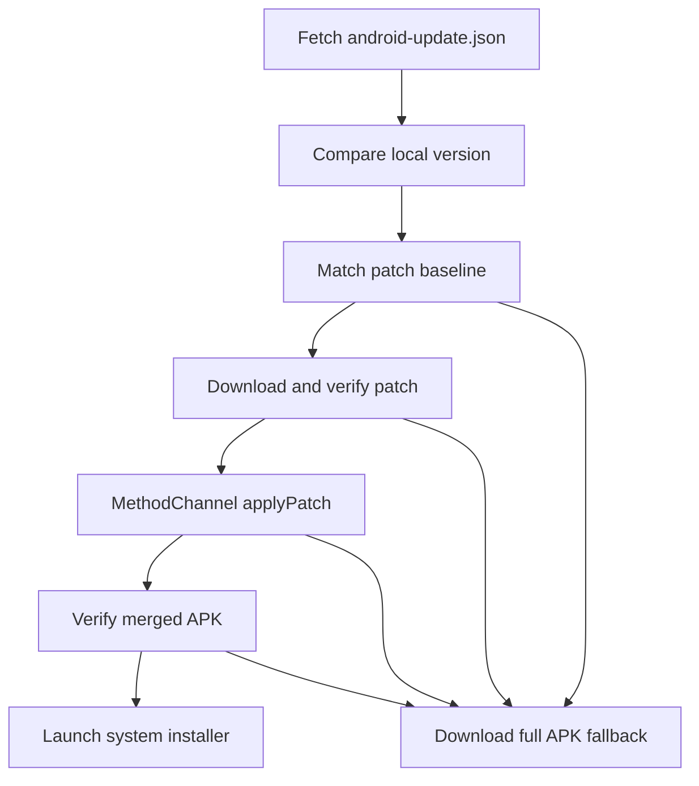

# Android Delta Update

Feature Name: android-delta-update
Updated: 2026-07-23

## Description

Android 客户端通过 GitHub 固定 Release 资产 URL获取更新配置，优先使用 bsdiff 差分包，失败时回退完整 APK。

## Architecture

## Components and Interfaces

- `AndroidUpdateManifest`：解析版本、完整 APK 和差分资产元数据。
- `AppUpdateService`：版本选择、下载、MD5/SHA-256 校验、回退和安装协调。
- `MethodChannel com.daidai.panel/app_install`：提供 `getInstalledApkInfo`、`applyPatch` 和 `installApk`。
- `BsDiffTool.patch`：在 Android IO 线程合并 `sourceDir` 与 patch。
- GitHub Actions：生成 patch、反向重建验证和 JSON。

## Data Models

更新 JSON 包含 schema、目标版本、完整 APK 元数据和最近版本到目标版本的 patch 数组。每个资产包含 URL、大小、MD5 和 SHA-256。

## Correctness Properties

- patch 仅在本地版本和旧 APK SHA-256 同时匹配时使用。
- 合并 APK 必须与 Release 完整 APK 哈希一致。
- 原生 patch 在后台串行执行。
- 系统安装器保留最终 APK签名验证和用户确认。

## Error Handling

- JSON、下载、MD5、SHA-256、合并或目标校验失败均回退完整 APK。
- 完整 APK失败沿用现有错误提示。
- 原生层限制 patch 和输出路径位于应用更新缓存目录。

## Performance Analysis

- 常驻开销：一次小型 JSON 请求，无后台合并任务，无常驻 native 内存。
- 更新开销：后台 CPU用于 bzip2 解压和文件合并；UI线程保持可用。
- 临时磁盘：约为 patch 大小加完整目标 APK大小及下载临时文件。
- 网络收益：patch 小于完整 APK时显著减少下载量；patch 收益不足时 CI可跳过发布。

## Test Strategy

- Dart 测试覆盖 JSON 解析、版本比较和资产选择。
- CI执行 `bsdiff -> bspatch -> cmp` 闭环。
- Flutter Analyze、Flutter Test 和 Android Release 构建。
- 真机验证补丁成功、MD5失败、基线不匹配和全量回退。
