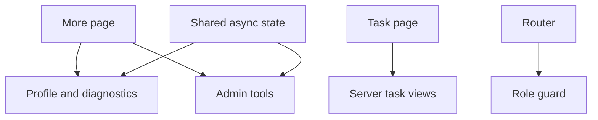

# Backend Capability Rollout

Feature Name: backend-capability-rollout
Updated: 2026-07-23

## Description

按 P0、P1 两阶段映射后端现有能力。每项独立提交，阶段结束后执行质量门禁和双平台构建。

## Architecture

## Components and Interfaces

- 新功能页面使用现有 `DioClient`、`ApiEndpoints`、Riverpod 和共享 Liquid Glass 组件。
- 任务视图使用独立 DTO 与 Provider，并将规则注入现有 TaskNotifier。
- 角色守卫集中在 GoRouter redirect。
- Android runtime 安装使用 POST SSE 专用客户端。
- 文件导出复用 `file_picker` 与本地保存模式。

## Correctness Properties

- 所有管理员入口与路由同时校验角色。
- 敏感 Token 响应按后端契约保持遮罩，不回显明文。
- POST SSE 以流关闭和失败前缀共同判断结果。
- 环境变量 IDs 导出时明确包含选中的禁用项。

## Error Handling

- 页面使用统一 Loading、Empty、Error 状态。
- 网络错误通过 `extractErrorMessage` 转换并保留重试入口。
- 破坏性操作使用确认对话框。

## Test Strategy

- DTO 与契约解析单元测试。
- Flutter Analyze 和 Flutter Test。
- 每阶段构建 Android APK 与 iOS IPA。
