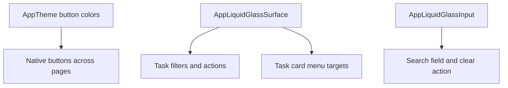

# Glass Button Consistency

Feature Name: glass-button-consistency
Updated: 2026-07-23

## Description

通过共享 Theme 透明材质和任务页局部共享组件迁移，消除白色及偏白实底业务按钮。

## Architecture

## Components and Interfaces

- `AppTheme`：降低原生按钮默认背景不透明度，并统一玻璃描边。
- `AppLiquidGlassInput`：保持搜索框 Lens，并让内部图标按钮使用透明背景。
- `_TaskGlassIconTarget`：统一任务页菜单和紧凑图标入口。
- `AppLiquidGlassSurface`：承载筛选、清理、排序提示和批量操作。

## Correctness Properties

- 所有迁移仅改变视觉组件包装和主题颜色。
- 按钮回调、文字、图标和布局约束保持不变。
- 状态徽标、终端、图表和底部导航保持现有实现。

## Error Handling

视觉组件不引入新的网络或存储错误路径。

## Test Strategy

- 执行 Flutter Analyze 和 Flutter Test。
- 构建 Android APK 与 iOS IPA。
- 回归任务搜索、批量、排序、筛选、菜单和运行按钮。
- 检查浅色、深色和 320dp 窄屏。
