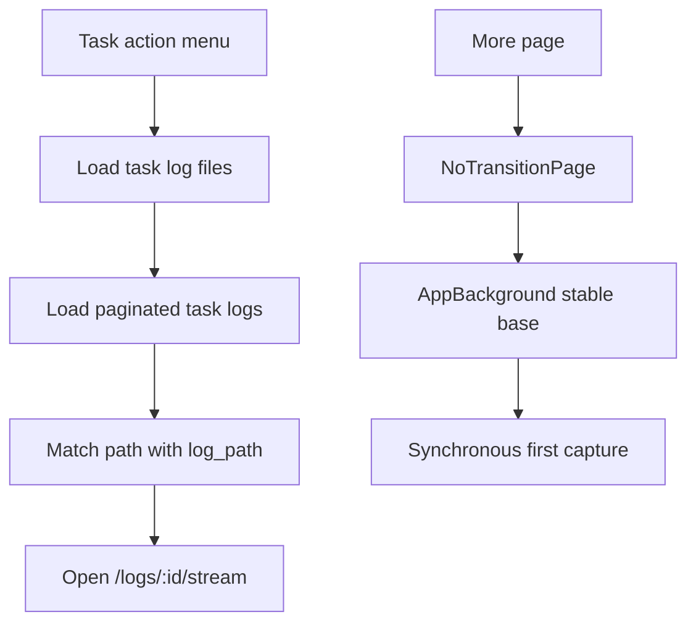

# UI Style, Log Navigation and Route Continuity

Feature Name: ui-log-navigation
Updated: 2026-07-23

## Description

本设计统一残留业务纯色表面，扩展任务日志文件弹窗为可导航列表，并修复更多页到 root 二级页面的背景首帧闪烁。

## Architecture

## Components and Interfaces

- `AppTheme`：为原生 Dialog、BottomSheet 和 PopupMenu 提供统一半透明玻璃材质参数。
- `AppLiquidGlassSurface`：替换业务页面中的大块纯色信息和预览表面。
- `_TaskLogFile`：解析日志文件接口中的 `filename`、`path`、`size` 和 `created_at`。
- `_TaskLogFileList`：展示文件元数据并根据关联日志 ID执行导航。
- `AppBackground`：提供稳定底色、图片层、模糊层和首帧同步捕获。
- `NoTransitionPage`：承载 root navigator 二级页面，避免全屏背景树交叉动画。

## Data Models

`_TaskLogFile` 包含文件名、相对路径、字节大小、创建时间和可选日志 ID。日志 ID通过任务日志分页响应中的 `TaskLog.logPath` 与文件 `path` 精确匹配获得。

## Correctness Properties

- 文件关联仅使用完整相对路径，避免同名文件冲突。
- 日志分页累计数量达到 `total` 或返回空页时停止。
- 导航前关闭日志文件 Dialog，保证 root navigator 只显示一个覆盖层。
- 功能性颜色表面保持现有语义，业务信息表面使用共享玻璃样式。

## Error Handling

- 日志文件或日志记录请求失败时显示项目统一错误通知。
- 孤立日志文件显示“无对应日志记录”，点击不触发错误路由。
- 背景图片加载失败时显示稳定主题背景色。

## Test Strategy

- 单元测试日志文件解析、文件大小格式化和路径关联。
- Flutter Analyze 与现有测试验证类型和生命周期安全。
- Android/iOS 构建验证 Liquid Glass Shader 与路由配置。
- 手工回归浅色、深色、有壁纸、无壁纸及更多页各二级入口。

## References

- `lib/features/tasks/views/task_list_page.dart`
- `lib/core/router/app_router.dart`
- `lib/shared/widgets/app_background.dart`
- `lib/core/theme/app_theme.dart`
