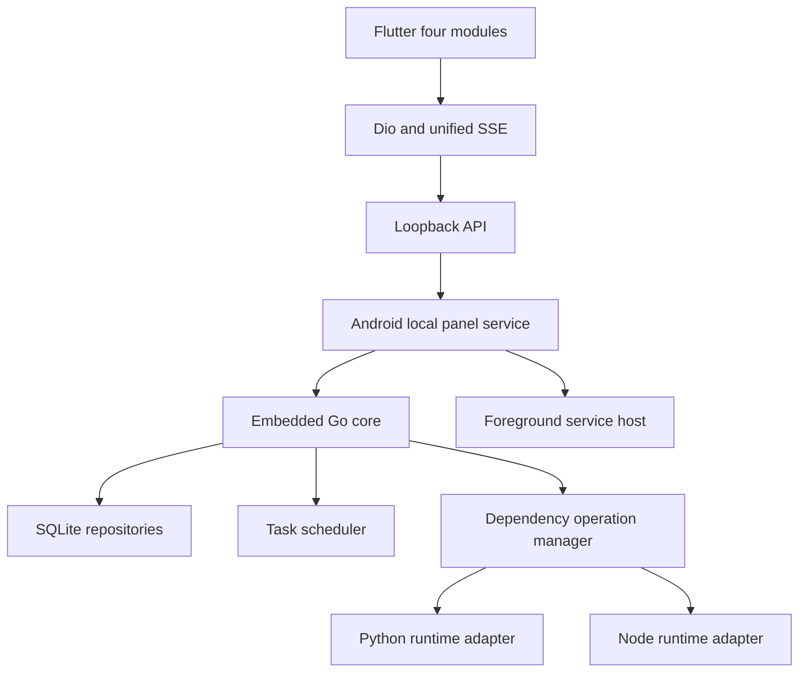

# Android 普通版本地核心 MVP 设计

Feature Name: android-local-core-mvp
Updated: 2026-07-24

## Description

在保留现有 Flutter 页面和 `/api` 契约的基础上，增加 Android 本地核心宿主。首期覆盖主页、任务、环境变量和依赖安装，并优先建立可靠的 Python/Node 运行时与依赖操作链路。

## Architecture

## Components and Interfaces

### LocalPanelHost

Flutter 侧稳定接口负责启动、停止、重启、状态、诊断和持续调度开关。Android 侧通过 MethodChannel 和 EventChannel 实现，业务页面继续通过本地 HTTP API 通信。

### LocalCapabilities

`GET /api/local/capabilities` 返回平台、架构、核心版本、运行时、精确调度等级、原生扩展支持和空间配额。四模块据此展示能力并在提交前校验。

### DependencyOperationManager

所有运行时与依赖变更使用统一操作模型：

- `queued`
- `running`
- `succeeded`
- `failed`
- `cancelled`
- `timedOut`

操作流包含递增 `sequence`、阶段、进度、日志、错误码和退出码。客户端以 sequence 去重和恢复。

### RuntimeComponentManager

管理 Python 3.12 ARM64 与 Node.js 20 ARM64 组件的清单、下载、签名、SHA-256、解压、原子切换、引用计数、配额和回滚。

### Existing Modules

- Dashboard 保留 `/api/system/info` 和 `/api/system/dashboard`。
- Task 保留现有 CRUD 与控制接口，新增任务级日志流和保存前能力校验。
- Env 保留现有接口，内部增加密文字段和导入事务。
- Dependency 保留现有列表接口，新增 runtime 与 operation 接口。

## Data Models

### RuntimeComponent

字段包括 ID、类型、版本、平台、架构、状态、下载大小、安装大小、SHA-256、签名状态、能力、包兼容等级和任务引用数。

### DependencyOperation

字段包括 ID、类型、状态、阶段、进度、可取消状态、事件序号、退出码、错误码、错误消息和时间戳。

### LocalPanelStatus

字段包括 phase、baseUrl、instanceId、coreVersion、schemaVersion、failureStage、message 和 foregroundServiceEnabled。

## Correctness Properties

1. 每个依赖操作只能进入一个终态。
2. 连接错误不能转换为安装成功。
3. 相同或更小 sequence 的日志事件不会重复追加。
4. 临时运行时通过全部校验后才能原子替换当前版本。
5. 安装失败后当前稳定运行时保持可用。
6. 本地服务只能绑定回环地址。
7. 环境变量密钥与数据库文件分离存储。

## Error Handling

- 依赖错误分为网络、解析、空间、摘要、签名、ABI、包冲突、进程退出、取消和超时。
- Flutter 页面分别展示加载错误、连接恢复、操作失败和操作取消。
- 长日志只在内存保留最近固定条数，完整日志由本地核心落盘。
- 本地核心异常退出采用有上限重启，连续失败进入 degraded 状态。

## Test Strategy

- Dart 测试覆盖依赖状态机、响应兼容解析、日志上限和错误终态。
- Go 测试覆盖四模块 Repository、操作状态机、迁移和运行时原子切换。
- Android 集成测试覆盖本地 Service、动态端口、前台服务、进程恢复和私有目录。
- ARM64 真机测试覆盖 Python、pip、Node、npm、取消、断网、低空间和升级回滚。
