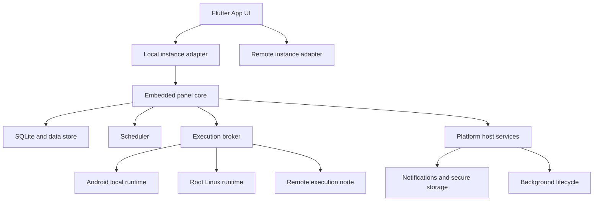
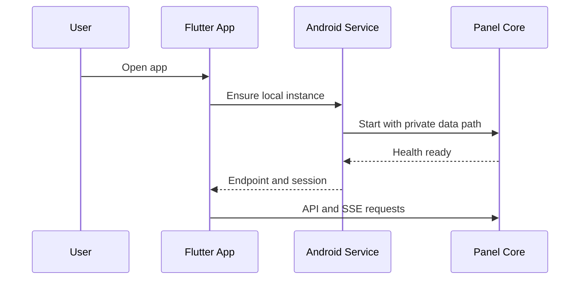
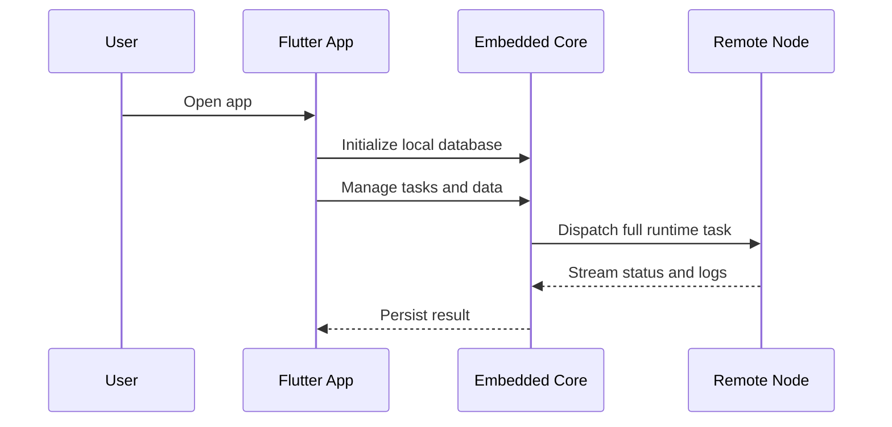

# 目标架构

## 架构原则

- Flutter UI继续作为统一管理界面。
- 后端业务规则集中在共享核心，减少 Android 与 iOS 行为差异。
- 平台宿主管理生命周期、文件系统、安全存储、通知和后台能力。
- 执行节点与管理核心解耦，使 iOS 能使用远程完整执行能力。
- 本地服务只监听回环地址，并使用每次安装生成的本地凭据。

## 总体架构



## 组件职责

### Flutter App UI

- 复用现有页面、模型、Dio、SSE 和路由。
- 新增本地实例引导、能力中心、运行时中心和执行节点管理。
- 在本地模式中自动配置本地端点和认证会话。

### Local Instance Adapter

- 负责本地核心启动、健康检查、端口发现和会话建立。
- 对 UI 暴露与远程服务器一致的 API 契约。
- Android MVP 可使用 `127.0.0.1` HTTP 与 SSE。
- 长期可切换到 FFI 或进程内调用，同时保持 Repository 接口稳定。

### Embedded Panel Core

建议从上游 Go 后端抽离以下模块：

- 配置和数据目录。
- SQLite Schema、迁移和 Repository。
- 认证、用户、角色和安全策略。
- 任务、Cron、日志、环境变量、脚本、订阅、通知、依赖和备份。
- Open API 与系统诊断。

### Execution Broker

- 根据任务类型、平台能力和用户策略选择执行节点。
- 统一流式输出、取消、超时、退出码和资源限制。
- 支持本地 Android、Root Linux 和远程节点。
- iOS 沙箱版主要使用受限本地动作与远程节点。

### Platform Host Services

Android：

- Foreground Service。
- WorkManager。
- Keystore。
- 私有文件目录与 Storage Access Framework 导入导出。
- 本地通知与开机恢复策略。

iOS：

- BGTaskScheduler。
- Keychain 与 Data Protection。
- App Group 预留。
- 本地通知、文件导入导出和后台状态提示。

## Android 进程模型

MVP 推荐同一 App 包内使用专用 Android Service 承载本地核心。Flutter Activity 退出后，用户启用的持续运行模式由前台服务保持。



## iOS 进程模型

iOS 推荐将共享核心编译为进程内库。App 处于前台时核心完整可用，后台任务由系统授予的执行窗口驱动。



## 数据目录建议

```text
app-data/
├── core/
│   ├── daidai.db
│   ├── config/
│   └── secrets/
├── scripts/
├── logs/
├── deps/
├── runtimes/
├── backups/
├── updates/
└── diagnostics/
```

## API 兼容策略

- 本地核心优先保持上游 `/api` 契约。
- App Repository 保持远程和本地调用一致。
- 平台专属能力通过 `/api/local/capabilities` 暴露。
- 执行节点通过版本化协议协商任务类型、运行时和日志流能力。
