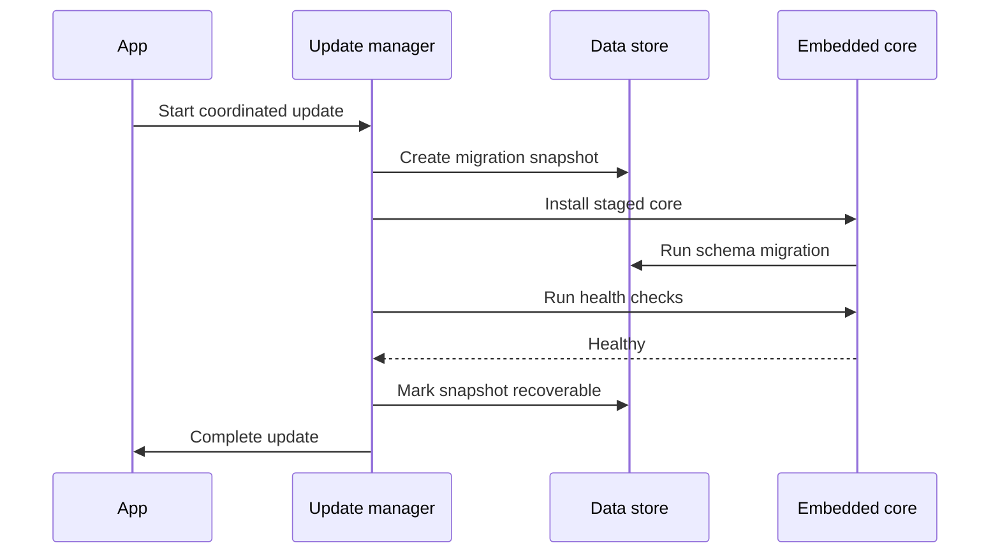

# 数据安全与更新

## 数据分类

| 数据 | 建议位置 | 保护策略 |
|---|---|---|
| SQLite 数据库 | App 私有持久目录 | 迁移前快照、定期备份 |
| JWT 与本地密钥 | Keystore 或 Keychain | 硬件支持时使用硬件保护 |
| 环境变量敏感值 | 数据库加密字段 | 密钥与数据库分离 |
| 脚本与订阅 | App 私有文件目录 | 版本记录、原子更新 |
| 任务日志 | 可清理持久目录 | 保留策略与空间配额 |
| Python 与 npm 依赖 | 可重建目录 | 组件校验与配额 |
| 运行时 | 可重建目录 | 签名、摘要和版本锁定 |
| 备份 | 用户选择位置 | 加密、摘要和版本元数据 |

## 本地通信安全

- Android 本地服务绑定 `127.0.0.1`。
- 启动时生成随机端口和短期本地会话凭据。
- 服务校验 Host、Origin 和 App 生成的本地授权头。
- Open API 默认关闭外部监听。
- 用户显式开启局域网访问时重新执行风险确认和防火墙能力检查。

## 备份格式

备份归档至少包含：

- Manifest 版本。
- App 版本与核心版本。
- 数据库 Schema 版本。
- 数据文件列表、大小和 SHA-256。
- 运行时需求清单。
- 加密参数与 KDF 元数据。

运行时二进制和依赖缓存默认从备份中排除，可根据清单重新下载或安装，以控制备份体积。

## 升级事务

## 回滚策略

- 核心二进制或库保留当前版本与上一稳定版本。
- Schema 迁移声明向前和回滚兼容范围。
- 健康检查覆盖数据库、调度器、运行时、磁盘和本地通信。
- 回滚恢复数据快照后重新校验行数、关键配置和任务状态。

## 卸载策略

- 系统卸载默认删除 App 私有数据。
- App 内提供“导出完整备份”入口。
- Android 可提供用户选择的外部备份目录。
- iOS 通过 Files 文档导出备份。
- “重置本地面板”需要二次确认并先提供备份选项。

## 供应链安全

- App、内置核心和运行时组件使用独立签名清单。
- Release 资产记录 SHA-256、版本、平台和架构。
- 运行时下载仅接受固定 HTTPS 域名和签名清单。
- 依赖安装展示来源、版本和原生代码标识。
- 诊断包执行 Token、Cookie、环境变量值和私钥脱敏。
